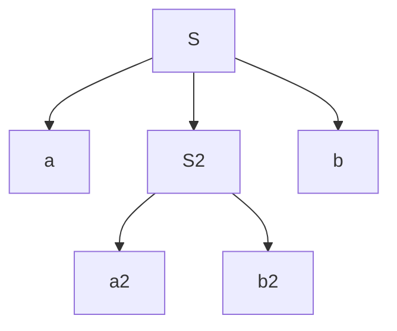

Un **albero di derivazione** è un [[Albero|albero]]  la cui radice contiene lo *starting point* e per ogni passo di [[Derivazione|derivazione]] si generano $n$ figli del nodo la cui derivazione è messa in atto

---

Esempio:
$$S \rightarrow aSb\ |\ \epsilon$$
