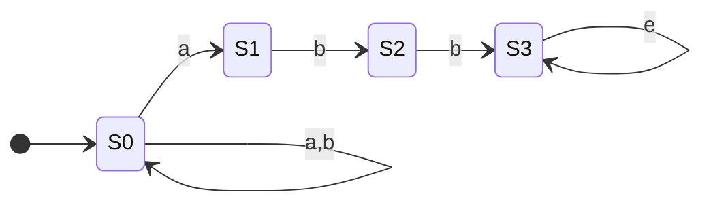

Un **automa a stati finiti non-deterministico** è un particolare tipo di [[Automa a Stati Finiti|macchina a stati finiti]] rappresentabile con una tupla
$$\mathcal{N} := (S, \mathcal{A}, \text{move}_{n}, S_{0}, F)$$
in cui:
- $S$ è un insieme di [[Stato|stati]]
- $\mathcal{A}$ è un [[Alfabeto|alfabeto]] con $\epsilon \notin \mathcal{A}$
- $s_{0} \in S$ è lo stato iniziale
- $F \subseteq S$ è l'insieme degli stati finiti o accettati
- $\text{move}_{n} : S \times (\mathcal{A} \cup \{ \epsilon \} \rightarrow 2^{S})$ è la funzione di transizione da un certo stato e con un certo simbolo

---

La rappresentazione grafica di un NFA è formata da un [[Grafo|grafo diretto]] con le seguenti caratteristiche:
- Gli stati rappresentano i nodi
- Lo stato iniziale è identificato da una freccia entrante
- Gli stati finali sono rappresentati da un doppio cerchio
- Le funzioni di transizione rappresentano gli archi

